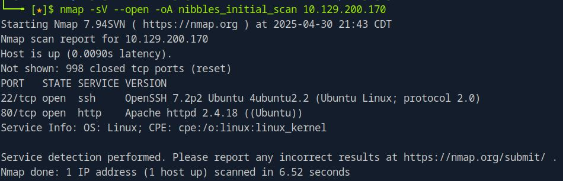

# 🐽 Nibbles — HTB Retired Machine Walkthrough

This is a **greybox penetration testing** project — meaning we had limited prior knowledge about the target, such as its IP address, but not full internal access like in a whitebox test.

---

## 🧾 Machine Summary

| Property              | Details                                         |
|-----------------------|-------------------------------------------------|
| **Machine Name**      | Nibbles                                         |
| **Created By**        | mrb3n                                           |
| **Operating System**  | Linux                                           |
| **Difficulty**        | Easy                                            |
| **User Path**         | Web Application                                 |
| **Privilege Escalation** | World-Writable File / Sudoers Misconfiguration |

---

## 🔍 Scope of Engagement

In a standard pentest, we go through multiple phases:  
- **Pre-engagement interactions**
- **Information gathering**
- **Vulnerability assessment**
- **Exploitation**
- **Post-exploitation**
- **Reporting**

For this CTF-like machine, some phases are **excluded**:

- **Pre-engagement** is skipped as this is a personal lab project with no client.
- **Proof of concept** and **reporting** are omitted as the goal is practice and documentation.

---

## 📌 What This Walkthrough Covers

We’ll walk through the following practical stages:

- 🔎 **Information Gathering (Enumeration)**  
- 🌐 **Vulnerability Assessment (Web Footprinting)**  
- 💥 **Exploitation (Initial Foothold)**  
- 🔐 **Post-Exploitation & Lateral Movement (Privilege Escalation)**  

Each step will demonstrate real-world techniques and explain the thought process of rooting this machine.

---

## 🔍 Enumeration
### ✅ Enumeration Summary (Table Format)

| Step                                | Action/Tool                          | Result                                                                 |
|-------------------------------------|--------------------------------------|------------------------------------------------------------------------|
| 🔍 Initial Nmap Scan                | `nmap -sV --open`                    | Found open ports: `22` (SSH), `80` (HTTP); Identified service versions |
| 🔍 Full TCP Scan                    | `nmap -p- --open`                    | No additional open ports found                                        |
| 📡 Banner Grabbing                  | `nc -nv`                             | SSH banner confirms OpenSSH; HTTP open but no banner shown            |
| 🧪 Scripted Nmap Scan               | `nmap -sC -p 22,80`                  | SSH host keys and basic HTTP info (no title)                          |
| 🧪 HTTP Enumeration Script          | `nmap --script=http-enum`           | Apache detected; no interesting directories or services revealed      |


We start with network and service discovery using Nmap.

### 🧪 Initial Scan (Top 1000 TCP Ports)
```bash
nmap -sV --open -oA nibbles_initial_scan 10.129.42.190
```
### 🧪 Initial Scan Flags Explained

- `-sV`: Service version detection  
- `--open`: Show only open ports  
- `-oA`: Output in all formats (`.nmap`, `.gnmap`, `.xml`)

  

### 📌 Findings from Initial Scan

- `22/tcp` – OpenSSH 7.2p2 (Ubuntu)  
- `80/tcp` – Apache HTTP Server (Ubuntu)  
- Host is likely running **Ubuntu Linux**

---

### 🔁 Full TCP Scan (All 65,535 Ports)
To catch services on non-standard ports:

```bash
nmap -p- --open -oA nibbles_full_tcp_scan 10.129.42.190
```
✅ No additional open ports found.

### 🖐 Banner Grabbing with Netcat

```bash
nc -nv 10.129.42.190 22
# → SSH-2.0-OpenSSH_7.2p2 Ubuntu-4ubuntu2.8

nc -nv 10.129.42.190 80
# → HTTP port open (no banner)
```

### 🔍 Scripted Scan (`-sC`)
Run default NSE scripts on open ports:

```bash
nmap -sC -p 22,80 -oA nibbles_script_scan 10.129.42.190
```
- Identified SSH host keys  
- HTTP title: "Site doesn't have a title"

```bash
nmap -sV --script=http-enum -oA nibbles_nmap_http_enum 10.129.42.190
```
- Detected Apache on port 80  
- No interesting directories or services revealed  

---

### 🧾 Summary of Findings (Enumeration Phase)

| Port | Service | Version                  |
|------|---------|--------------------------|
| 22   | SSH     | OpenSSH 7.2p2 (Ubuntu)   |
| 80   | HTTP    | Apache (version redacted)|
