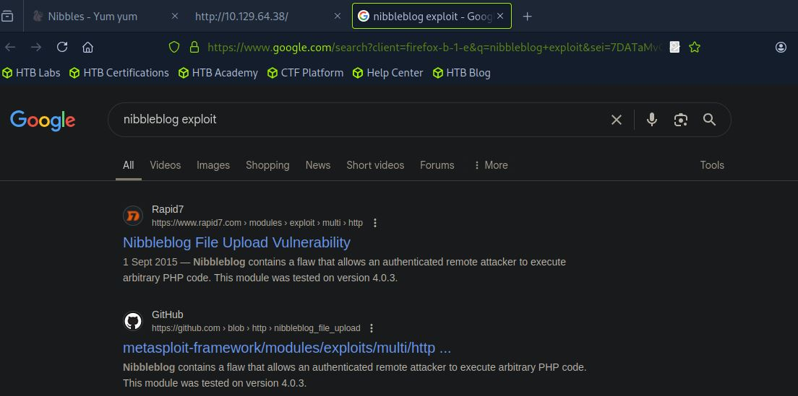

# 🎯 Nibbles — HTB Retired Machine Walkthrough

 
 
This is a **greybox penetration testing** project — meaning we had limited prior knowledge about the target, such as its IP address, but not full internal access like in a whitebox test.

---

## 🧾 Machine Summary

| Property              | Details                                         |
|-----------------------|-------------------------------------------------|
| **Machine Name**      | Nibbles                                         |
| **Created By**        | mrb3n                                           |
| **Operating System**  | Linux                                           |
| **Difficulty**        | Easy                                            |
| **User Path**         | Web Application                                 |
| **Privilege Escalation** | World-Writable File / Sudoers Misconfiguration |

---

## 🔍 Scope of Engagement

In a standard pentest, we go through multiple phases:  
- **Pre-engagement interactions**
- **Information gathering**
- **Vulnerability assessment**
- **Exploitation**
- **Post-exploitation**
- **Reporting**

For this CTF-like machine, some phases are **excluded**:

- **Pre-engagement** is skipped as this is a personal lab project with no client.
- **Proof of concept** and **reporting** are omitted as the goal is practice and documentation.

---

## 📌 What This Walkthrough Covers

We’ll walk through the following practical stages:

- 🔎 **Information Gathering (Enumeration)**  
- 🌐 **Vulnerability Assessment (Web Footprinting)**  
- 💥 **Exploitation (Initial Foothold)**  
- 🔐 **Post-Exploitation & Lateral Movement (Privilege Escalation)**  

Each step will demonstrate real-world techniques and explain the thought process of rooting this machine.

---

## 🔍 Enumeration

### ✅ Enumeration Summary (Table Format)
Here's a quick overview of the enumeration steps performed and what each one revealed:

| Step                                | Action/Tool                          | Result                                                                 |
|-------------------------------------|--------------------------------------|------------------------------------------------------------------------|
| 🔍 Initial Nmap Scan                | `nmap -sV --open`                    | Found open ports: `22` (SSH), `80` (HTTP); Identified service versions |
| 🔍 Full TCP Scan                    | `nmap -p- --open`                    | No additional open ports found                                        |
| 📡 Banner Grabbing                  | `nc -nv`                             | SSH banner confirms OpenSSH; HTTP open but no banner shown            |
| 🧪 Scripted Nmap Scan               | `nmap -sC -p 22,80`                  | SSH host keys and basic HTTP info (no title)                          |
| 🧪 HTTP Enumeration Script          | `nmap --script=http-enum`           | Apache detected; no interesting directories or services revealed      |


We start with network and service discovery using Nmap.

### 🧪 Initial Scan (Top 1000 TCP Ports)

```bash
nmap -sV --open -oA nibbles_initial_scan 10.129.42.190
```

### 🧪 Initial Scan Flags Explained

- `-sV`: Service version detection  
- `--open`: Show only open ports  
- `-oA`: Output in all formats (`.nmap`, `.gnmap`, `.xml`)

  

### 📌 Findings from Initial Scan

- `22/tcp` – OpenSSH 7.2p2 (Ubuntu)  
- `80/tcp` – Apache HTTP Server (Ubuntu)  
- Host is likely running **Ubuntu Linux**

### 🔁 Full TCP Scan (All 65,535 Ports)

To catch services on non-standard ports:

```bash
nmap -p- --open -oA nibbles_full_tcp_scan 10.129.42.190
```

✅ No additional open ports found.

### 🖐 Banner Grabbing with Netcat

```bash
nc -nv 10.129.42.190 22
# → SSH-2.0-OpenSSH_7.2p2 Ubuntu-4ubuntu2.8

nc -nv 10.129.42.190 80
# → HTTP port open (no banner)
```

### 🔍 Scripted Scan (`-sC`)

Run default NSE scripts on open ports:

```bash
nmap -sC -p 22,80 -oA nibbles_script_scan 10.129.42.190
```
- Identified SSH host keys  
- HTTP title: "Site doesn't have a title"

```bash
nmap -sV --script=http-enum -oA nibbles_nmap_http_enum 10.129.42.190
```
- Detected Apache on port 80  
- No interesting directories or services revealed  

### 🧾 Summary of Findings (Enumeration Phase)

| Port | Service | Version                  |
|------|---------|--------------------------|
| 22   | SSH     | OpenSSH 7.2p2 (Ubuntu)   |
| 80   | HTTP    | Apache (version redacted)|

---

## Web Footprinting
We can use whatweb to try to identify the web application in use.

This tool does not identify any standard web technologies in use. Browsing to the target in Firefox shows us a simple "Hello world!" message.

Checking the page source reveals an interesting comment.

The HTML comment mentions a directory named nibbleblog. Let us check this with whatweb.

Now we are starting to get a better picture of things. We can see some of the technologies in use such as HTML5, jQuery, and PHP. We can also see that the site is running Nibbleblog, which is a free blogging engine built using PHP.

Directory Enumeration
Browsing to the /nibbleblog directory in Firefox, we do not see anything exciting on the main page.

A quick Google search for "nibbleblog exploit" yields this Nibbleblog File Upload Vulnerability. 

The flaw allows an authenticated attacker to upload and execute arbitrary PHP code on the underlying web server. The Metasploit module in question works for version 4.0.3. We do not know the exact version of Nibbleblog in use yet, but it is a good bet that it is vulnerable to this. If we look at the source code of the Metasploit module, we can see that the exploit uses user-supplied credentials to authenticate the admin portal at /admin.php.

Let us use Gobuster to be thorough and check for any other accessible pages/directories.

Gobuster finishes very quickly and confirms the presence of the admin.php page. We can check the README page for interesting information, such as the version number.

So we validate that version 4.0.3 is in use, confirming that this version is likely vulnerable to the Metasploit module (though this could be an old README page). Nothing else interesting pops out at us. Let us check out the admin portal login page.

Now, to use the exploit mentioned above, we will need valid admin credentials. We can try some authorization bypass techniques and common credential pairs manually, such as admin:admin and admin:password, to no avail. There is a reset password function, but we receive an e-mail error. Also, too many login attempts too quickly trigger a lockout with the message Nibbleblog security error - Blacklist protection.

Let us go back to our directory brute-forcing results. The 200 status codes show pages/directories that are directly accessible. The 403 status codes in the output indicate that access to these resources is forbidden. Finally, the 301 is a permanent redirect. Let us explore each of these. Browsing to nibbleblog/themes/. We can see that directory listing is enabled on the web application. Maybe we can find something interesting while poking around?

