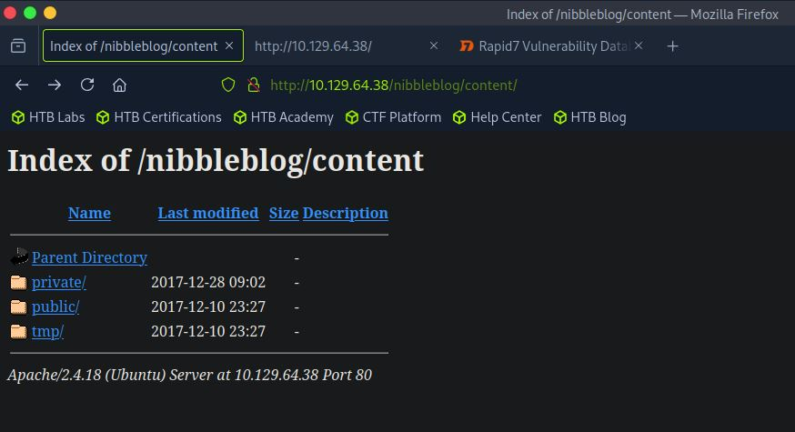
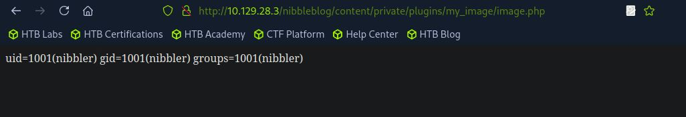

# 🎯 Nibbles — HTB Retired Machine Walkthrough

 
 
This is a **greybox penetration testing** project — meaning we had limited prior knowledge about the target, such as its IP address, but not full internal access like in a whitebox test.

---

## 🧾 Machine Summary

| Property              | Details                                         |
|-----------------------|-------------------------------------------------|
| **Machine Name**      | Nibbles                                         |
| **Created By**        | mrb3n                                           |
| **Operating System**  | Linux                                           |
| **Difficulty**        | Easy                                            |
| **User Path**         | Web Application                                 |
| **Privilege Escalation** | World-Writable File / Sudoers Misconfiguration |

---

## 🔍 Scope of Engagement

In a standard pentest, we go through multiple phases:  
- **Pre-engagement interactions**
- **Information gathering**
- **Vulnerability assessment**
- **Exploitation**
- **Post-exploitation**
- **Reporting**

For this CTF-like machine, some phases are **excluded**:

- **Pre-engagement** is skipped as this is a personal lab project with no client.
- **Proof of concept** and **reporting** are omitted as the goal is practice and documentation.

---

## 📌 What This Walkthrough Covers

We’ll walk through the following practical stages:

- 🔎 **Information Gathering (Enumeration)**  
- 🌐 **Vulnerability Assessment (Web Footprinting)**  
- 💥 **Exploitation (Initial Foothold)**  
- 🔐 **Post-Exploitation & Lateral Movement (Privilege Escalation)**  

Each step will demonstrate real-world techniques and explain the thought process of rooting this machine.

---

## 🔍 Enumeration

### ✅ Enumeration Summary (Table Format)
Here's a quick overview of the enumeration steps performed and what each one revealed:

| Step                                | Action/Tool                          | Result                                                                 |
|-------------------------------------|--------------------------------------|------------------------------------------------------------------------|
| 🔍 Initial Nmap Scan                | `nmap -sV --open`                    | Found open ports: `22` (SSH), `80` (HTTP); Identified service versions |
| 🔍 Full TCP Scan                    | `nmap -p- --open`                    | No additional open ports found                                        |
| 📡 Banner Grabbing                  | `nc -nv`                             | SSH banner confirms OpenSSH; HTTP open but no banner shown            |
| 🧪 Scripted Nmap Scan               | `nmap -sC -p 22,80`                  | SSH host keys and basic HTTP info (no title)                          |
| 🧪 HTTP Enumeration Script          | `nmap --script=http-enum`           | Apache detected; no interesting directories or services revealed      |


We start with network and service discovery using Nmap.

### 🧪 Initial Scan (Top 1000 TCP Ports)

```bash
nmap -sV --open -oA nibbles_initial_scan 10.129.42.190
```

### 🧪 Initial Scan Flags Explained

- `-sV`: Service version detection  
- `--open`: Show only open ports  
- `-oA`: Output in all formats (`.nmap`, `.gnmap`, `.xml`)

  

### 📌 Findings from Initial Scan

- `22/tcp` – OpenSSH 7.2p2 (Ubuntu)  
- `80/tcp` – Apache HTTP Server (Ubuntu)  
- Host is likely running **Ubuntu Linux**

### 🔁 Full TCP Scan (All 65,535 Ports)

To catch services on non-standard ports:

```bash
nmap -p- --open -oA nibbles_full_tcp_scan 10.129.42.190
```

✅ No additional open ports found.

### 🖐 Banner Grabbing with Netcat

```bash
nc -nv 10.129.42.190 22
# → SSH-2.0-OpenSSH_7.2p2 Ubuntu-4ubuntu2.8

nc -nv 10.129.42.190 80
# → HTTP port open (no banner)
```

### 🔍 Scripted Scan (`-sC`)

Run default NSE scripts on open ports:

```bash
nmap -sC -p 22,80 -oA nibbles_script_scan 10.129.42.190
```
- Identified SSH host keys  
- HTTP title: "Site doesn't have a title"

```bash
nmap -sV --script=http-enum -oA nibbles_nmap_http_enum 10.129.42.190
```
- Detected Apache on port 80  
- No interesting directories or services revealed  

### 🧾 Summary of Findings (Enumeration Phase)

| Port | Service | Version                  |
|------|---------|--------------------------|
| 22   | SSH     | OpenSSH 7.2p2 (Ubuntu)   |
| 80   | HTTP    | Apache (version redacted)|

---

## 🌐 Web Footprinting

Once we had port 80 open, I decided to explore the web service manually and with tools to identify technologies, hidden paths, and potential vulnerabilities.

### 🔎 Step 1: Identify Web Technologies

- Ran `whatweb` on the base URL.
- No major web technologies were detected.
- Visiting in Firefox showed a simple `Hello world!` message.

  


### 🧠 Step 2: Inspect Page Source

- Checked page source.
- Found a **comment** pointing to a `/nibbleblog` directory.


### 🔍 Step 3: Probe the Nibbleblog Directory

- Ran `whatweb` again, this time on `/nibbleblog`.
- Now it detected:
  - **Nibbleblog CMS**
  - **HTML5**
  - **jQuery**
  - **PHP**


### 🗂️ Step 4: Manual Browsing & Vulnerability Research

- Visited `/nibbleblog` in browser – default CMS page.
- A quick Google search for “nibbleblog exploit” revealed:
  - A **File Upload Vulnerability** in version **4.0.3**
  - Supported by a **Metasploit module**
  - Requires **authentication**

  


### 🚪 Step 5: Directory Bruteforcing

- Used `gobuster` to enumerate directories inside `/nibbleblog`
- Found:
  - `/admin.php`
  - `/readme.html`
  - `/themes/`
  - `/content/`


### 📖 Step 6: Check README for Version Info

- Opened the `readme.html` file
- Version **4.0.3** confirmed
- This matches the version affected by the Metasploit exploit


### 🔐 Step 7: Try Admin Portal

- Navigated to `/nibbleblog/admin.php`
- Tried common credentials like `admin:admin`, `admin:password`
- Login failed
- Password reset gives **email error**
- Too many failed attempts triggered **blacklist protection**


### 🧰 Step 8: Explore Accessible & Forbidden Directories

| Status Code | Meaning               | Action Taken                   |
|-------------|------------------------|--------------------------------|
| 200         | Accessible             | Explored contents              |
| 403         | Forbidden              | Marked for potential bypass    |
| 301         | Redirect               | Followed to see final content  |

- `/themes/` → Directory listing enabled, but nothing useful
  
  


- `/content/` → Contained `public`, `private`, and `tmp` folders
  


### 🧾 Step 9: Sensitive File Discovery

- Found `users.xml` in `/private`
  - Confirmed `admin` username
  - Listed blacklisted IPs

  


- No password found.
- Documentation confirmed there’s no default password for admin.

### 🧩 Step 10: Final Directory Sweep

- No new directories found after additional brute-forcing at root.
- Manually reviewing known directories revealed one more file:
  - `config.xml`
``` bash
curl -s http://10.129.42.190/nibbleblog/content/private/config.xml | xmllint --format -

<?xml version="1.0" encoding="utf-8" standalone="yes"?>
<config>
  <name type="string">Nibbles</name>
  <slogan type="string">Yum yum</slogan>
  <footer type="string">Powered by Nibbleblog</footer>
  <advanced_post_options type="integer">0</advanced_post_options>
  <url type="string">http://10.129.42.190/nibbleblog/</url>
  <path type="string">/nibbleblog/</path>
  <items_rss type="integer">4</items_rss>
  <items_page type="integer">6</items_page>
  <language type="string">en_US</language>
  <timezone type="string">UTC</timezone>
  <timestamp_format type="string">%d %B, %Y</timestamp_format>
  <locale type="string">en_US</locale>
  <img_resize type="integer">1</img_resize>
  <img_resize_width type="integer">1000</img_resize_width>
  <img_resize_height type="integer">600</img_resize_height>
  <img_resize_quality type="integer">100</img_resize_quality>
  <img_resize_option type="string">auto</img_resize_option>
  <img_thumbnail type="integer">1</img_thumbnail>
  <img_thumbnail_width type="integer">190</img_thumbnail_width>
  <img_thumbnail_height type="integer">190</img_thumbnail_height>
  <img_thumbnail_quality type="integer">100</img_thumbnail_quality>
  <img_thumbnail_option type="string">landscape</img_thumbnail_option>
  <theme type="string">simpler</theme>
  <notification_comments type="integer">1</notification_comments>
  <notification_session_fail type="integer">0</notification_session_fail>
  <notification_session_start type="integer">0</notification_session_start>
  <notification_email_to type="string">admin@nibbles.com</notification_email_to>
  <notification_email_from type="string">noreply@10.10.10.134</notification_email_from>
  <seo_site_title type="string">Nibbles - Yum yum</seo_site_title>
  <seo_site_description type="string"/>
  <seo_keywords type="string"/>
  <seo_robots type="string"/>
  <seo_google_code type="string"/>
  <seo_bing_code type="string"/>
  <seo_author type="string"/>
  <friendly_urls type="integer">0</friendly_urls>
  <default_homepage type="integer">0</default_homepage>
</config>
```

While examining the `config.xml`, we didn't find any passwords — but we noticed:

- Site name: **Nibbles**
- Notification email: **admin@nibbles.com**
- The **HTB box name** is also *nibbles*

💡 **Observation:**  
These repetitive mentions made us suspect **"nibbles"** might be the admin password.

### ✅ Login Attempt: Success

We used the following credentials:

- **Username**: `admin` (confirmed earlier from `users.xml`)
- **Password**: `nibbles` (inferred from config hints)


📌 We are now logged into the **Nibbleblog admin portal**.

### 🧾 Summary of Findings (Vulnerability Assessment/ Web Footprinting Phase)

Here’s what we’ve accomplished so far:

| Step | Task Performed                                                                 |
|------|--------------------------------------------------------------------------------|
| 1️⃣   | Ran `nmap` – Found ports `22` (SSH) and `80` (HTTP)                           |
| 2️⃣   | Visited the web server – Saw "Hello world!" with no tech revealed             |
| 3️⃣   | Checked page source – Found `/nibbleblog` in HTML comment                     |
| 4️⃣   | Used `whatweb` – Detected **Nibbleblog**, PHP, HTML5, and jQuery              |
| 5️⃣   | Explored `/nibbleblog` – Found login portal at `/admin.php`                   |
| 6️⃣   | Ran `gobuster` – Confirmed presence of admin panel and other directories      |
| 7️⃣   | Found `README` – Identified version as **4.0.3**, known to be vulnerable       |
| 8️⃣   | Explored `/content/private/` – Found `users.xml` and `config.xml`             |
| 9️⃣   | Confirmed **admin** username                                                  |
| 🔟   | Noted blacklist protection for too many login attempts                         |
| 🔑   | Guessed the password **nibbles** based on config hints – login successful!     |

---

## 🧩 Initial Foothold

Now that we are logged into the **Nibbleblog admin portal**, our next step is to gain **code execution** and escalate to a **reverse shell** on the webserver.

We explored the following admin pages:

| Page     | Purpose                              |
|----------|--------------------------------------|
| Publish  | Create new content                   |
| Comments | View existing comments (none found)  |
| Manage   | Edit/delete posts and categories     |
| Settings | Confirms version 4.0.3               |
| Themes   | Install pre-selected themes          |
| Plugins  | Manage plugins (upload enabled)      |

### 📁 Plugin Exploration

- The **My image plugin** allows us to upload an image file.
- Could this be exploited to upload a **malicious PHP file**?


- Uploading files via page/post creation didn’t work.
- We then visited the **Plugins** page.


- We tried uploading a **PHP test snippet** via this plugin.


- Uploaded using the Browse button:


- Errors appeared but might not indicate failure:


### 🔍 Finding the Uploaded File

- Based on earlier enumeration, the plugin files live at:
- 
http://<host>/nibbleblog/content/private/plugins/my_image/

- Browsing to this directory, we found our file:




- We then confirmed **command execution** using curl:


✅ We have **Remote Code Execution (RCE)** running as the `nibbler` user!

### 🐚 Reverse Shell Setup

Next steps:

- Edited the PHP file to include a **reverse shell one-liner**
- Added our VPN IP in `<ATTACKING IP>` and a listener port in `<LISTENING PORT>`


- Uploaded the PHP file again
- Started a Netcat listener:


- Executed the payload via curl or browser:

http://nibbleblog/content/private/plugins/my_image/image.php


🎉 Reverse shell successfully caught!

### 🧪 Shell Upgrade

The shell wasn’t fully interactive, so we upgraded it using:

``` bash
python3 -c 'import pty; pty.spawn("/bin/bash")'
```
Now interactive, we navigated to the home directory.


### 🏁 User Flag Obtained

- Navigated to `/home/nibbler`
- Retrieved and submitted the `user.txt` flag

| File Name     | Description               |
|---------------|---------------------------|
| `user.txt`    | 🎯 User flag              |
| `personal.zip`| 📦 Archive file, suspicious |


---
## 🧠 Privilege Escalation

We have shell access as the **nibbler** user. Time to escalate!

### 📦 Found Archive

- Unzipped `personal.zip`
- Revealed a script: `monitor.sh`
- File is **owned and writeable** by `nibbler`

  


### 🛠️ Recon with LinEnum

- Served `LinEnum.sh` from local machine
- Pulled it on target using `wget`
- Made it executable and ran it

  


#### 🔍 Interesting Output:

| Finding | Details |
|---------|---------|
| `sudo` privilege | `nibbler` can run `/home/nibbler/personal/stuff/monitor.sh` as root |


### 🚀 Gaining Root

- Appended a reverse shell one-liner to `monitor.sh`
- Started a netcat listener
- Executed script with `sudo`
- Got a root shell!

  
  
  


---

## ✅ Conclusion

This was my **first successful pwn** of a retired Hack The Box machine!

🔍 Key lessons:
- Enumeration is everything — even the smallest config leak can matter
- Always explore what writeable files and `sudo` permissions are available
- Use tools like LinEnum to speed up privilege escalation checks

More write-ups coming soon. 🧑‍💻

---

